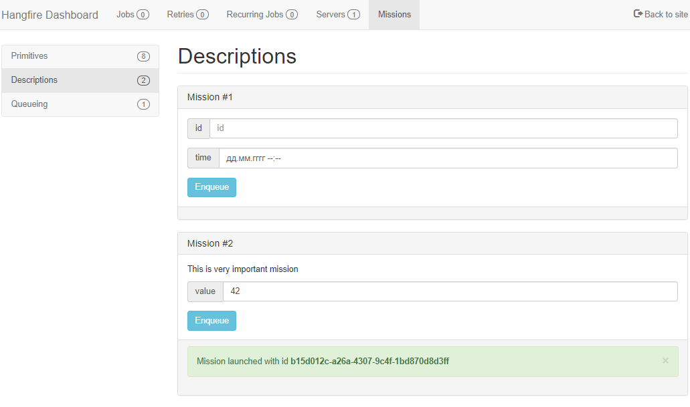

# Hangfire.MissionControl
[](https://www.nuget.org/packages/Hangfire.MissionControl/)
[](https://github.com/ahydrax/Hangfire.MissionControl/actions/workflows/build-and-test.yml)


A plugin for Hangfire that enables you to launch jobs manually.

Read about hangfire here: https://github.com/HangfireIO/Hangfire#hangfire-
and here: http://hangfire.io/

## Instructions
* Install NuGet package
* Decorate your code with attributes *(all parameters are optional)*
```csharp
[MissionLauncher(CategoryName = "Emails")]
public class EmailSenderMissions
{
    [Mission(Name = "Send email", 
        Description = "Send email to customer", 
        Queue = "emails")]
    public string SendEmail(int customerId, string displayName) => //...code;
}
```
* Setup dashboard code
```csharp
// If you use ASP .NET Core
services.AddHangfire(configuration => configuration.UseMissionControl(typeof(EmailSenderMissions).Assembly));

// If you use console application
GlobalConfiguration.Configuration.UseMissionControl(typeof(EmailSenderMissions).Assembly);
```

## License
Authored by: Viktor Svyatokha (ahydrax)

This project is under MIT license. You can obtain the license copy [here](https://github.com/ahydrax/Hangfire.MissionControl/blob/master/LICENSE).